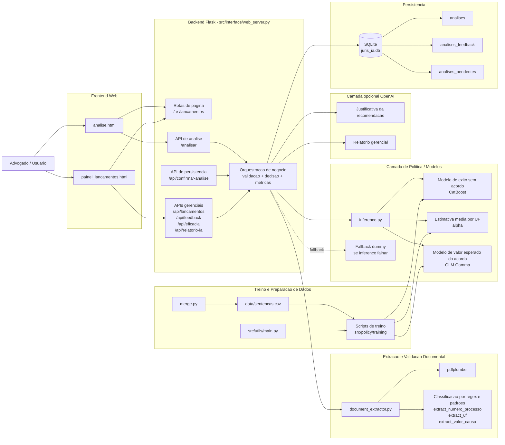
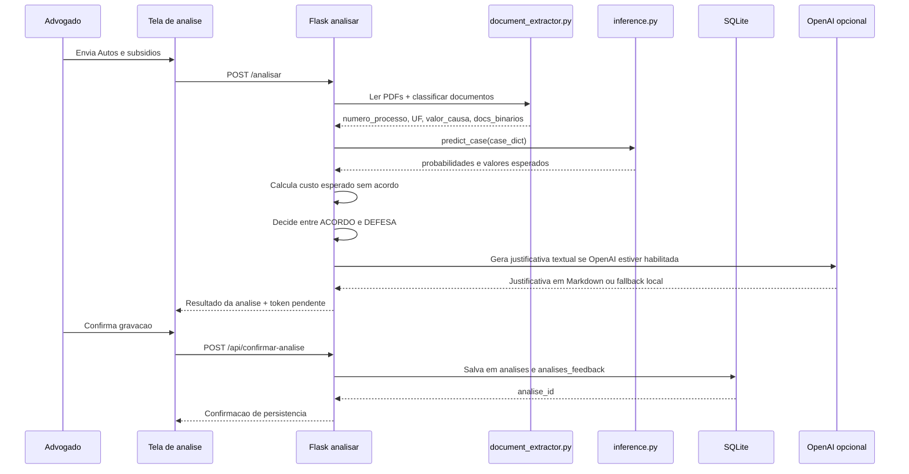
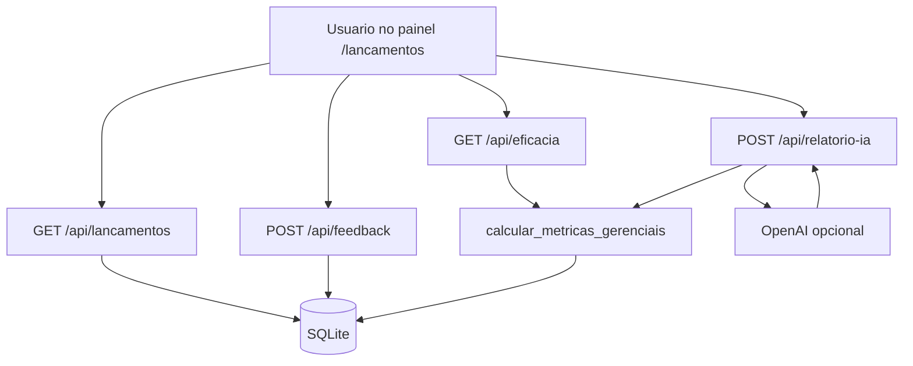

# Diagrama de Arquitetura da Solucao

Este documento descreve a arquitetura do **JurisIA** com base no codigo atual do repositorio.

## Visao geral

O sistema e composto por sete blocos principais:

- **Frontend web** em HTML/Tailwind, servido pelo Flask
- **Backend Flask** que orquestra validacao, inferencia, persistencia e relatorios
- **Camada de extracao documental** para classificar PDFs e extrair campos dos Autos
- **Camada de modelos estatisticos** para calcular custo esperado de acordo e defesa
- **Persistencia e monitoramento** em SQLite, com apoio opcional da OpenAI para explicacoes textuais
- **Camada opcional de IA generativa** para justificativas e relatorio gerencial
- **Pipeline de preparo e treino** para gerar a base consolidada e treinar os modelos

## Diagrama principal

## Fluxo de analise de um caso

## Fluxo gerencial e de feedback

## Mapeamento de componentes para arquivos

| Componente | Arquivo principal | Responsabilidade |
|---|---|---|
| Frontend de analise | `src/interface/templates/analise.html` | Upload dos documentos, exibicao da recomendacao e confirmacao |
| Frontend gerencial | `src/interface/templates/painel_lancamentos.html` | Consulta de analises, feedback e KPIs |
| Backend principal | `src/interface/web_server.py` | Rotas Flask, regras de negocio, persistencia e integracao com OpenAI |
| Extracao documental | `src/interface/document_extractor.py` | Classificacao documental e extracao de campos dos Autos |
| Relatorio offline/auxiliar | `src/interface/management_report.py` | Geracao de metricas e relatorio gerencial fora da interface |
| Classificacao LLM opcional | `src/interface/llm_subtopic.py` | Classificacao complementar de sub-assunto |
| Inferencia estatistica | `src/policy/app/inference.py` | Carregamento de modelos e predicao |
| Exemplo de execucao local | `src/policy/app/app.py` | Teste simples da inferencia |
| Treino de P(E) | `src/policy/training/P(E _ ¬A, X).py` | Classificador de exito sem acordo |
| Treino de E alpha por UF | `src/policy/training/E[α _ UF].py` | Estimador medio por UF |
| Treino de E VP no acordo por VT | `src/policy/training/E[$_VT].py` | Modelo Gamma para valor esperado do acordo |
| Consolidacao da base | `src/policy/training/merge.py` | Gera `data/sentencas.csv` a partir do XLSX |
| Orquestrador do treino | `src/utils/main.py` | Executa os scripts de treino em sequencia |

## Decisao de negocio implementada

O backend segue esta logica:

- `E(VP | A)` vem do modelo de acordo
- `P(E | not A, X)` vem do classificador
- `E[alpha | UF]` estima a fracao paga quando nao ha exito
- `E(VP | not A, X) = (1 - P(E | not A, X)) * E[alpha | UF] * VT`
- a recomendacao final escolhe o menor custo esperado

## Observacoes sobre a arquitetura atual

- A arquitetura e adequada para MVP e demonstracao de hackathon.
- O backend centraliza muitas responsabilidades em `web_server.py`; uma evolucao natural seria separar servicos, repositorios e casos de uso.
- A persistencia em SQLite simplifica a demo, mas pode ser trocada por Postgres em um ambiente multiusuario.
- A camada OpenAI e opcional e desacoplada do fluxo minimo, o que ajuda na resiliencia do sistema.
